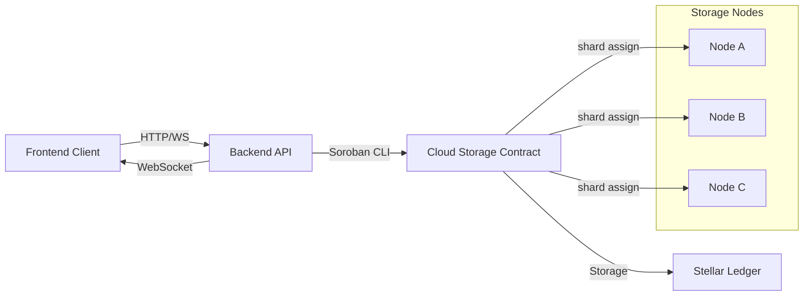

# Cloud Storage Architecture

## System Overview

## Data Flow

### File Upload

1. Client calculates file content hash (SHA-256) and splits file into N shards, computing per-shard hashes.
2. Client calls `POST /api/cloud-storage/files` with metadata and shard hashes.
3. Backend invokes `upload_file` contract function via Soroban CLI.
4. Contract validates parameters, checks pause state, verifies owner auth.
5. Contract iterates shards, selects available nodes based on capacity, and assigns each shard to `redundancy_factor` nodes.
6. For each assignment, contract emits `ShardAssigned` event.
7. After all shards assigned, contract saves `FileMetadata` and emits `FileUploaded`.

### File Retrieval

1. Client calls `GET /api/cloud-storage/files/:fileId`.
2. Backend invokes `get_file`, which reads metadata from contract storage.
3. Metadata includes shard list and node addresses for reconstruction.

### Shard Rebalancing

1. Client or admin calls `POST /api/cloud-storage/files/:fileId/rebalance`.
2. Contract checks each shard; if any node is missing or overloaded, it selects replacement nodes.
3. New assignments are made, `ShardAssigned` events emitted, and `ShardsRebalanced` final event.

### Node Registration

1. Storage node operator calls `POST /api/cloud-storage/nodes` with their address and capacity.
2. Contract authenticates caller as the node address, creates or updates `NodeInfo`.
3. Emits `NodeRegistered` event.

## Storage Model

- Instance storage: admin, file count, shard counter, pause flag, node count.
- Persistent storage:
  - `File(file_id) → FileMetadata`
  - `Shard(file_id, index) → ShardInfo`
  - `Node(node) → NodeInfo` (capacity, used, active)
  - `NodeFiles(node) → Vec<file_id>`
  - `AllNodes → Vec<Address>`

## Redundancy & Health

- Each shard is stored on `redundancy_factor` distinct nodes.
- Rebalancing ensures at least that many copies remain available.
- Nodes with insufficient free capacity are skipped during assignment.

## Security

- Authentication via `require_auth()` for owner and node operations.
- Admin-only pause/unpause.
- All state changes emit events for off-chain audit.
